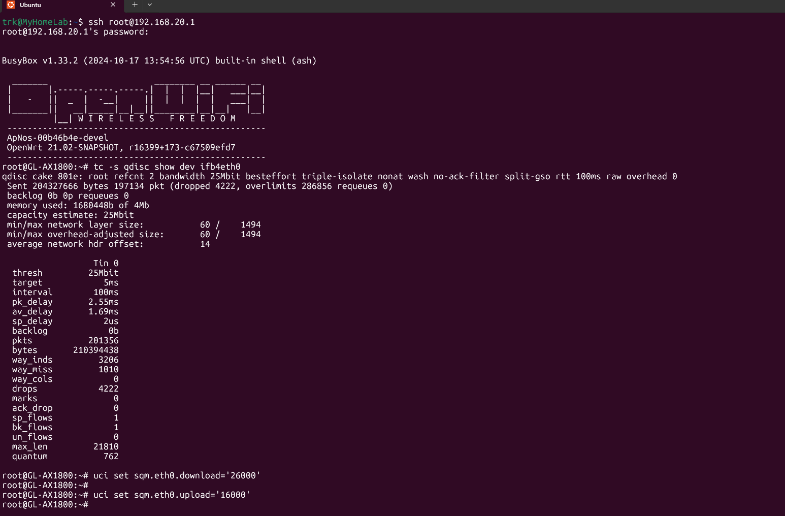

# LTE Bufferbloat Fix for OpenWrt Qualcomm-based routers (GL.iNet GL-AX1800 for this example)

**Fix high latency on LTE connections by forcing traffic through CPU-based SQM/CAKE shaping.**

Tested on GL-AX1800 running OpenWrt with LTE/cellular WAN.



---

## The Problem

Qualcomm-based routers offload LTE traffic to hardware (NSS/SFE), bypassing the Linux network stack. This makes SQM invisible to traffic, causing:
- High latency under load
- Poor real-time performance (calls, gaming, remote work)
- Speed tests look fine, but actual experience is terrible

## The Solution

This fix forces WAN traffic through the CPU using:
- IFB (Intermediate Functional Block) interface for ingress shaping
- Disabled hardware acceleration (NSS/SFE)
- Persistent scripts that survive reboots and LTE reconnects

**Trade-off:** Lower raw throughput in exchange for stable, low latency.

---

## Quick Start

### Prerequisites
- OpenWrt router 
- LTE/cellular WAN connection
- SSH access to router
- Basic command line knowledge

### Step 1: Install Init Scripts

**SSH into your router:**
```bash
ssh root@your.router.ip
```


Calculate Your SQM Speeds

Run 3-5 speed tests at different times. Use your **lowest consistent speeds** and set SQM to **85-90%** of those values.

**Example:** If you get 30 Mbps down / 12 Mbps up → Set SQM to 25 Mbps / 10 Mbps

```bash
# Set speeds (values in kbit/s)
uci set sqm.eth0.download='25000'  # 25 Mbps
uci set sqm.eth0.upload='10000'    # 10 Mbps
uci commit sqm
/etc/init.d/sqm restart
```


**Create the init script files:**
```bash
vi /etc/init.d/sqm-fix
vi /etc/init.d/99-sqm-fix
```

**Copy script contents from [SCRIPTS.md](SCRIPTS.md)**

Press `i` to edit, paste content, then save with `ESC` → `:wq` → `ENTER`

**Make scripts executable and enable on boot:**
```bash
chmod +x /etc/init.d/sqm-fix
chmod +x /etc/init.d/99-sqm-fix
/etc/init.d/sqm-fix enable
/etc/init.d/99-sqm-fix enable
```

**Reboot to apply:**
```bash
reboot
```

### Step 2: Verify It's Working

To check if sqm is working run:

```
tc -s qdisc show dev ifb4eth0
```
You should get an output as below, which confirm SQM is working:

```
root@GL-AX1800:~# tc -s qdisc show dev ifb4eth0
qdisc cake 8029: root refcnt 2 bandwidth 23Mbit besteffort triple-isolate nonat nowash no-ack-filter split-gso rtt 100ms raw overhead 0
 Sent 807718 bytes 1148 pkt (dropped 1, overlimits 1046 requeues 0)
 backlog 0b 0p requeues 0
 memory used: 128640b of 4Mb
 capacity estimate: 23Mbit
 min/max network layer size:           60 /    1454
 min/max overhead-adjusted size:       60 /    1454
 average network hdr offset:           14

                  Tin 0
  thresh         23Mbit
  target            5ms
  interval        100ms
  pk_delay       1.13ms
  av_delay        370us
  sp_delay          8us
  backlog            0b
  pkts             1149
  bytes          809010
  way_inds            0
  way_miss           50
  way_cols            0
  drops               1
  marks               0
  ack_drop            0
  sp_flows            0
  bk_flows            1
  un_flows            0
  max_len          6695
  quantum           701

qdisc ingress ffff: parent ffff:fff1 ----------------
 Sent 0 bytes 0 pkt (dropped 0, overlimits 0 requeues 0)
 backlog 0b 0p requeues 0
```

After reboot, check if IFB interface exists:
```bash
ip link show ifb4eth0
```

Check SQM status:
```bash
/etc/init.d/sqm status
```

Run a bufferbloat test at [waveform.com/tools/bufferbloat](https://www.waveform.com/tools/bufferbloat)

---

## Repository Contents

| File | Description |
|------|-------------|
| `README.md` | This file - setup guide and overview |
| `SCRIPTS.md` | Complete init scripts with detailed explanations |
| `example.png` | Bufferbloat test results |
| `example2.png` | Additional visual reference |
| `example3.png` | Configuration screenshots |

---

## Important Notes

⚠️ **This intentionally reduces throughput for latency control** - unavoidable trade-off for working SQM on LTE

⚠️ **Re-enabling hardware offloading breaks SQM** - don't enable NSS/SFE

⚠️ **Rollback:** If something breaks, remove scripts and reboot to restore defaults

✅ **Best for:** Remote work, video calls, gaming, or any latency-sensitive use case

---

## Tested Environment

- **Router:** GL-AX1800
- **Firmware:** OpenWrt
- **WAN:** LTE / Cellular
- **QoS:** SQM with CAKE qdisc (ingress + egress)

Other Qualcomm-based OpenWrt routers should work with minimal changes.

---

## Troubleshooting

**SQM not working after setup?**
- Check if hardware offloading is disabled
- Verify IFB interface exists: `ip link show ifb4eth0`
- Check logs: `logread | grep sqm`

**Speeds too slow?**
- Your SQM limits may be too conservative
- Increase to 90-95% of your lowest test results

**LTE reconnects break SQM?**
- Ensure `99-sqm-fix` hotplug script is installed
- Check if it's executable: `ls -l /etc/init.d/99-sqm-fix`

**Need to revert everything?**
```bash
/etc/init.d/sqm-fix disable
rm /etc/init.d/sqm-fix
rm /etc/init.d/99-sqm-fix
reboot
```

---

## ⚠️ Important 

* Ensure you have a backup of your configuration before proceeding.
  


